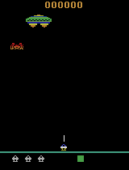
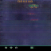
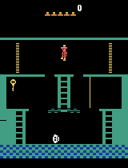

# RLTesting
Just to track some minor projects/learning small things

# Torch
DreamerV3 Implementation  
  
  
PPO Implementation  
* Random Network Distillation  

  

Fundamental Variable Discovery and Neural Variables  

# JAX
PPO Implementation  
* 2048 from pgx  
